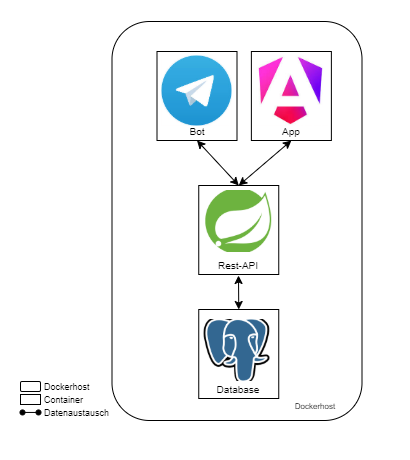
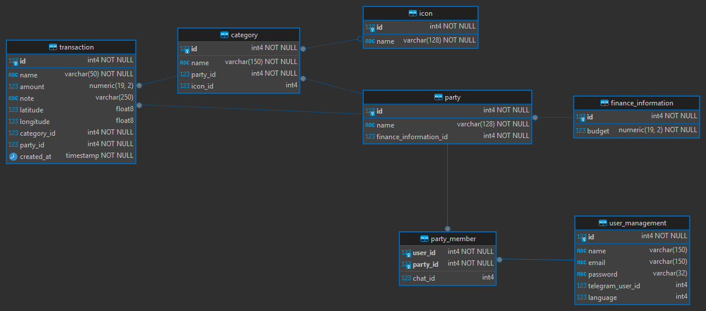

# RestFinanceApi

## Architecture
The Finance-API is used by an Angular app and Telegram bot. Both applications writes and read data via the rest api.
The rest api is a Spring Boot application that provides endpoints for add, manipulate or remove data.



## Database
In the following database diagram describes the structure of the database tables:



## Start docker db and initialize database with database structure and testdata:
```
bash startDatabaseWithTestdata.sh
```

## application.properties
```
spring.jpa.hibernate.ddl-auto=none

spring.datasource.initialization-mode=always
spring.datasource.driver-class-name=com.mysql.cj.jdbc.Driver
spring.jpa.properties.hibernate.dialect=org.hibernate.dialect.MySQL5InnoDBDialect
spring.datasource.platform=org.hibernate.dialect.MySQL5InnoDBDialect
spring.jpa.show-sql=true
spring.datasource.url=jdbc:mysql://<url>:<port>/<databasename>
spring.datasource.username=<user>
spring.datasource.password=<password>

spring.jpa.properties.hibernate.jdbc.lob.non_contextual_creation=true

server.port=9000
server.error.include-stacktrace=always
spring.thymeleaf.enabled=true

```

